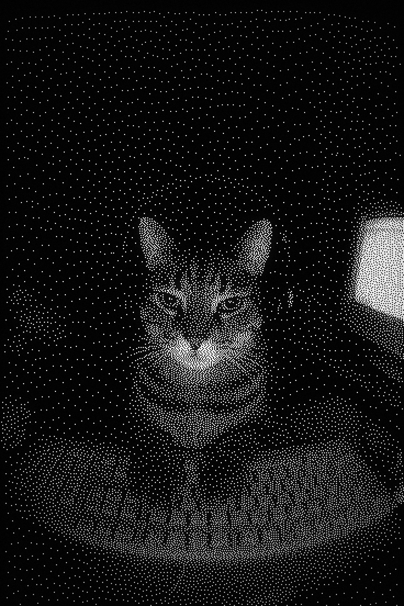

<h1><code>yogyeberry@github ~ $ ./contributions.sh</code></h1>

  

<h1><code>yogyeberry@github ~ $ whoami</code></h1>

<table align="center">
<tr>

<td width="38%" align="center" valign="middle">

</td>

<td width="62%" valign="middle">

<pre>
┌──────────────────────────────────────────────────────┐
│  🔴  🟡  🟢              About Me                    │
├──────────────────────────────────────────────────────┤
│                                                      │
│  yogyeberry@github                                   │
│  Developer · Builder · Problem Solver                │
│                                                      │
├──────────────────────────────────────────────────────┤
│                                                      │
│  ABOUT                                               │
│  Sophomore B.Tech student focused on web development,│
│  real-world applications, and problem solving.       │
│                                                      │
│  STACK                                               │
│  JavaScript · Node.js · React · Express · Python     │
│  PostgreSQL · REST APIs · HTML · CSS · Tailwind      │
│  Git · GitHub · Vercel · Unity · C#                  │
│                                                      │
│  CURRENTLY                                           │
│  Building web projects, exploring Unity game dev,    │
│  and keeping the LeetCode streak alive.              │
│                                                      │
└──────────────────────────────────────────────────────┘
</pre>

</td>

</tr>
</table>

 

  

